# Snow-Domo 360

> **Pipeline Observability for Snowflake + Domo.** A single-pane-of-glass dashboard that unifies Snowflake account telemetry with Domo pipeline metadata — giving data platform teams, FinOps practitioners, and executive stakeholders real-time visibility into cost, performance, pipeline health, data quality, and AI-driven query optimization without leaving Domo.


---

## Table of Contents

1. [The Problem](#-the-problem)
2. [Visual Tour](#-visual-tour)
3. [Architecture](#-architecture)
4. [Tech Stack](#-tech-stack)
5. [Dataset Aliases & Manifest](#-dataset-aliases--manifest)
6. [Getting Started](#-getting-started)
7. [Key Design Decisions](#-key-design-decisions)
8. [File Structure](#-file-structure)
9. [Security & Privacy](#-security--privacy)
10. [License](#-license)

---

## 🎯 The Problem

Organizations running Snowflake through Domo face a common blind spot: Snowflake's `ACCOUNT_USAGE` views and Domo's connector/DataFlow telemetry live in **separate silos**. Engineers toggle between Snowflake's query history UI and Domo's activity logs to answer straightforward questions:

- *"Which warehouse is burning credits with low utilization?"*
- *"Are our connector SLAs being met?"*
- *"Which queries could be rewritten for 50%+ improvement?"*

Snow-Domo 360 eliminates that context-switching by joining both telemetry sources into a unified, interactive dashboard with **seven purpose-built views** and a **persistent alerting system**.

---

## 📸 Visual Tour

> [!NOTE]
> Screenshots reflect the default dark-sidebar / light-content theme. A full dark mode is available via the sidebar toggle.

<br>

### 💰 Cost & Credits

Track Snowflake spend patterns and resource utilization at a glance. KPI cards show **Total Spend**, **Daily Credits Avg**, **Active Warehouses**, and a composite **Efficiency Score**. A dual-axis *Credits and Cost Over Time* chart reveals when cost rises faster than credit consumption. The *Warehouse Cost Distribution* treemap and *Warehouse Utilization* bar chart provide per-warehouse context.

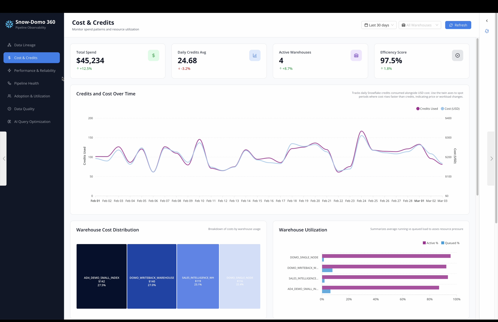

Scrolling down: *Cost per Successful Row* normalizes spend against throughput, *Daily Credits by Service Type* exposes mix shifts (e.g., AI Services growing), and *Top 10 Domo Datasets by Cost* ranks the most expensive data assets. The persistent **Alerts panel** (right) surfaces live alerts and AI recommendations.

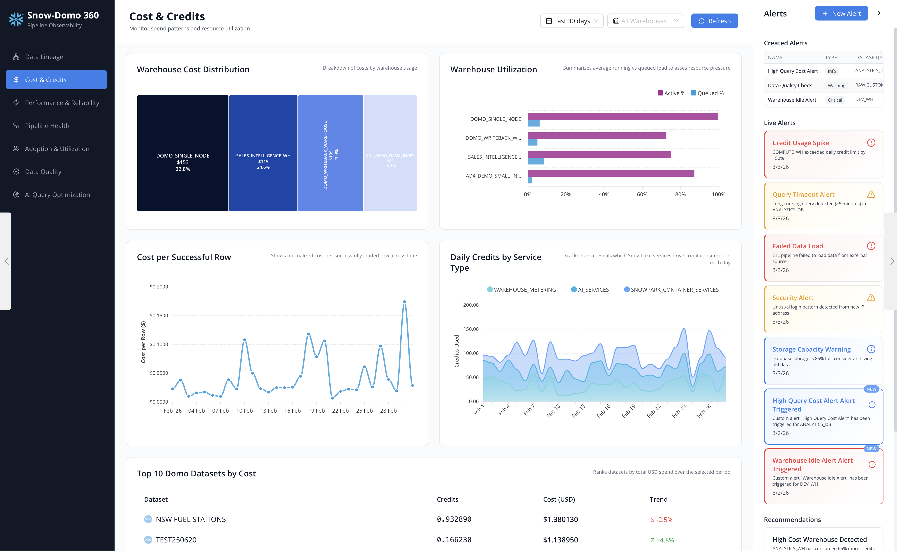

| Metric | Description | Source |
|--------|-------------|--------|
| **Total Spend** | Aggregated USD cost over selected period |  |
| **Daily Credits Avg** | Mean daily credit consumption with trend |  |
| **Active Warehouses** | Count of warehouses with activity |  |
| **Efficiency Score** | Credits per 1M rows — lower is better |  |

<br>

### ⚡ Performance & Reliability

The **bee-swarm scatter** (Observable Plot + D3) plots every query as a clickable dot — blue for fast, magenta for slow. Click any dot to open an inline *Query Details* panel showing Query ID, execution time, query type, database, warehouse, and SQL text. Below: *P95 Query Duration Trend* with an SLA threshold reference line, and a sortable *Slowest Connector Runs* table.

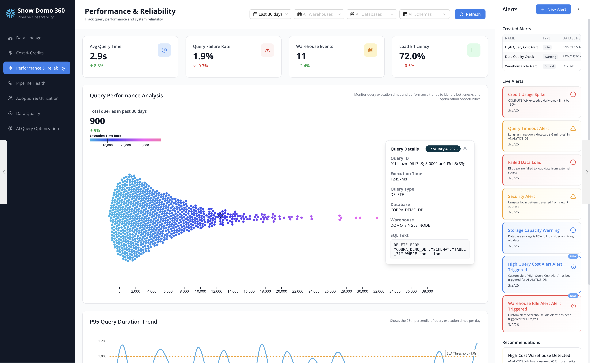

| Metric | Description | Source |
|--------|-------------|--------|
| **Avg Query Time** | Mean execution time across all query types |  |
| **Query Failure Rate** | % of queries ending in error |  |
| **Warehouse Events** | Suspend / resume event count |  |
| **Load Efficiency** | Compute time ÷ wall-clock time |  |

<br>

### 🔗 Pipeline Health

*Bytes Ingested & API Anomalies* overlays daily bytes with an API z-score band — values beyond **±2σ** are shaded as anomalies. The *End-to-End Latency Heatmap* (dataset × day) spots chronic late feeds. *Connector Success Rate* and *SLA Breaches Heatmap* break down reliability. Stale datasets get a clickable **Details** popout.

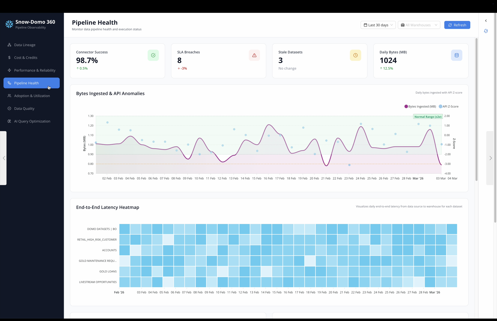

| Metric | Description | Source |
|--------|-------------|--------|
| **Connector Success** | % of runs completing without error |  |
| **SLA Breaches** | Connectors exceeding target latency |  |
| **Stale Datasets** | Not refreshed within expected window |  |
| **Daily Bytes (MB)** | Volume ingested per day |  |

<br>

### 📊 Adoption & Utilization

The flagship chart is the **Cost vs. Utilization Quadrant** — an interactive bubble chart classifying each dataset into one of four quadrants. Hover any bubble for AI-generated **Why / Action / Watch** guidance.

| Quadrant | Meaning | Action |
|----------|---------|--------|
| 🔴 **Rationalize** | High cost, low utilization | Consolidate, downsize, or deprecate |
| 🟠 **Optimize & Scale** | High cost, high utilization | Tune schedules, consider auto-suspend |
| 🟡 **Monitor** | Low cost, low utilization | Watch for growth before investing |
| 🟢 **Best Value** | Low cost, high utilization | Keep schedules, modest scale-up if queues appear |

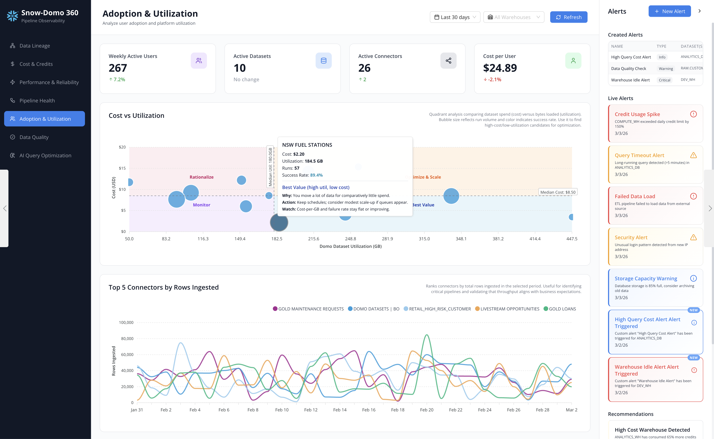

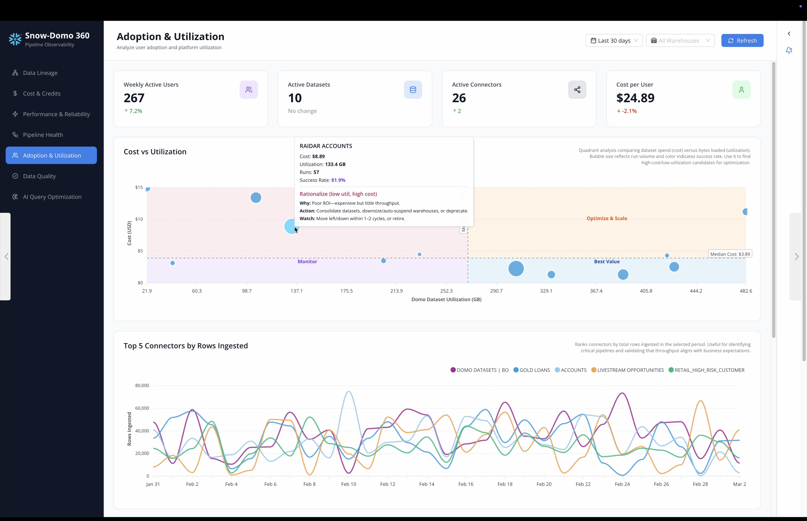

| Metric | Description | Source |
|--------|-------------|--------|
| **Weekly Active Users** | Unique users in trailing 7 days |  |
| **Active Datasets** | Queried or refreshed in period |  |
| **Active Connectors** | With at least one run |  |
| **Cost per User** | Total spend ÷ WAU |  |

<br>

### 🛡️ Data Quality

The **Schema Drift → Null Regression Matrix** heatmap shows null-rate changes across columns from **−7 to +2 days** relative to a schema change event — pinpointing which column adds, removes, or modifications caused regressions. *Lift (pp) vs. Baseline* ranks the largest percentage-point increases. *Coverage Anomalies* plots row-count z-scores, and a *Schema Drift Log* provides a filterable timeline.

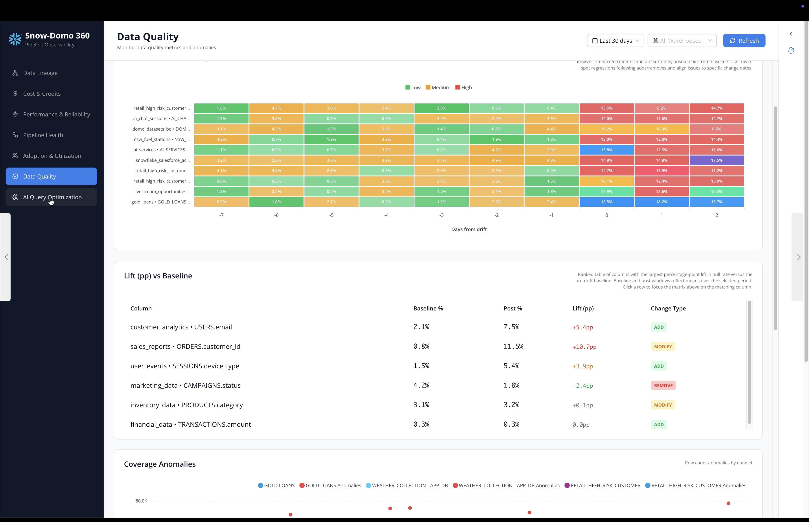

| Metric | Description | Source |
|--------|-------------|--------|
| **Data Completeness** | % of datasets with null rate below threshold |  |
| **Rule Violations** | Data accuracy rule violation count |  |
| **Schema Changes** | Column adds / removes / modifies in trailing week |  |
| **Consistency Score** | Referential integrity pass rate |  |
| **Orphan Rate** | Orphan rows as % of total |  |

<br>

### 🗺️ Data Lineage

An interactive **DAG** (directed acyclic graph) traces data from source to derived datasets. Nodes are color-coded by domain. Filter by domain, toggle Sources Only / Derived Only, search by table name. Zoom, pan, and export.

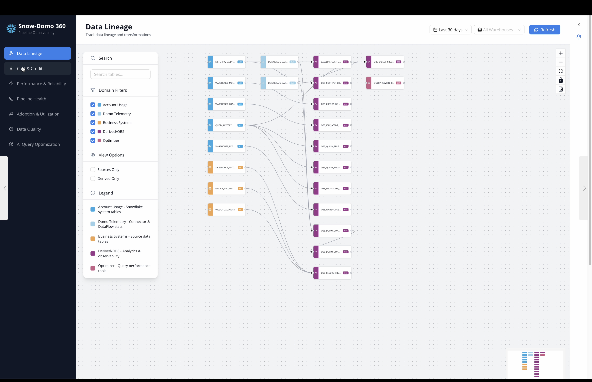

| Domain | Color | Description |
|--------|-------|-------------|
|  | Blue | Snowflake system tables |
|  | Light blue | Connector & DataFlow stats |
|  | Orange | Source data tables |
|  | Purple | Analytics & observability |
|  | Pink | Query performance tools |

<br>

### 🤖 AI Query Optimization

AI-powered query rewrite recommendations with side-by-side comparison. Summary KPIs — **Total Queries Analyzed**, **Avg Improvement**, **Est. Credits Saved**, **Adoption Rate** — followed by a *Performance Distribution* histogram, *Action Breakdown* donut, and *Savings Timeline* area chart.

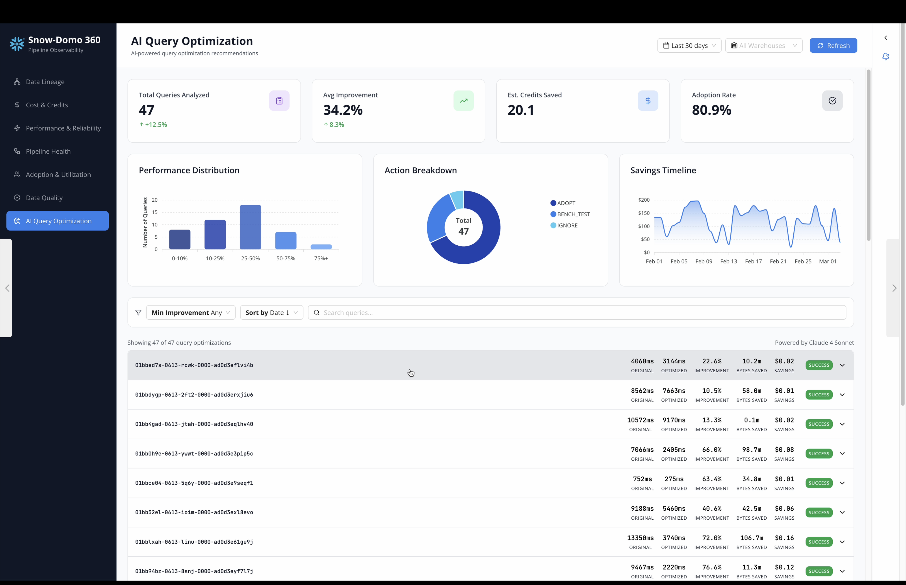

Each query card shows original vs. optimized SQL in syntax-highlighted **Monaco editors**. Per-query metrics include compilation time, execution time, bytes scanned, improvement %, bytes saved, and estimated USD savings.

> **Powered by** 

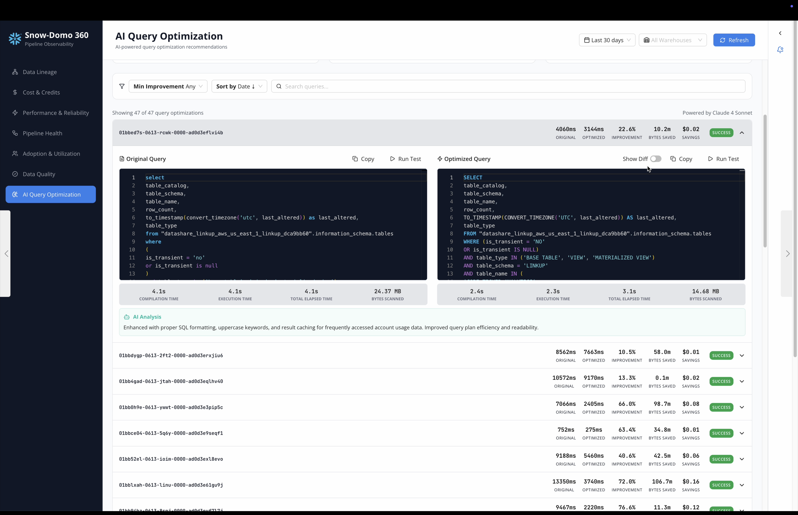

Toggle **Show Diff** for unified diff highlighting — insertions in green, deletions in red.

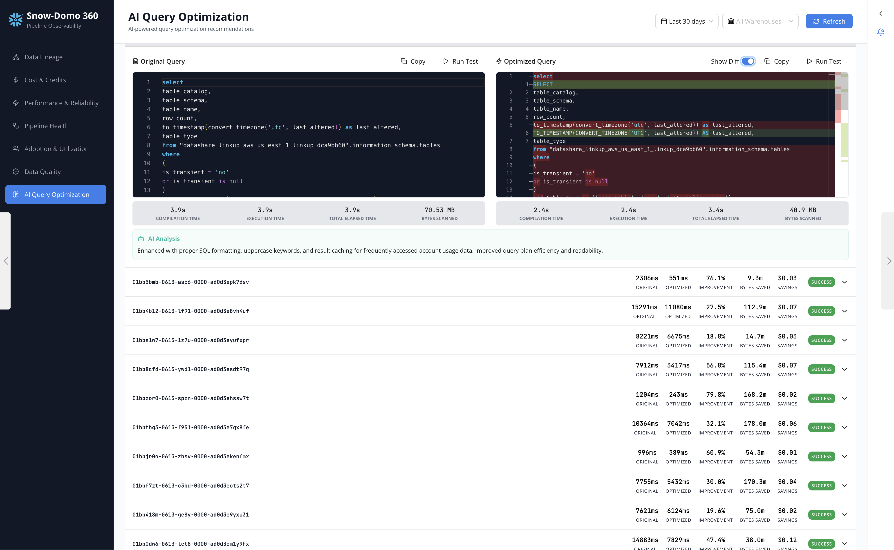

| Feature | Detail | Status |
|---------|--------|--------|
| **Side-by-side editors** | Monaco with custom dark theme, read-only, SQL syntax |  |
| **Diff view** | Inline insertions (green) and deletions (red) |  |
| **Action classification** | `ADOPT` · `BENCH_TEST` · `IGNORE` per query |  |
| **Copy & Run Test** | One-click copy or simulated test execution |  |
| **Filters** | Min improvement %, sort, full-text search |  |

<br>

### 🔔 Alerting System

A persistent right-hand panel available on Performance, Adoption, and Cost views.

| Component | Description | Status |
|-----------|-------------|--------|
| **Created Alerts** | User-defined alerts with name, severity, target datasets |  |
| **Live Alerts feed** | Credit Spike · Query Timeout · Failed Load · Security · Storage |  |
| **"NEW" badge** | Blue border + badge for recently triggered alerts |  |
| **+ New Alert modal** | Monaco SQL editor or AI-assisted generation via Cortex |  |
| **Recommendations** | AI-generated operational suggestions |  |

---

## 🏗️ Architecture

```
┌──────────────────────────────────────────────────────────────┐
│                        Domo Platform                         │
│                                                              │
│  ┌─────────────┐    ┌──────────────┐    ┌────────────────┐   │
│  │  Snowflake   │    │   Domo       │    │  Domo Custom   │   │
│  │  Account     │───▶│  Writeback   │───▶│   App (this)   │   │
│  │  Usage Views │    │  Connector   │    │                │   │
│  └─────────────┘    └──────────────┘    │  index.html    │   │
│                                         │  app.js        │   │
│  ┌─────────────┐    ┌──────────────┐    │  app.css       │   │
│  │  Domo       │    │  DataFlow /  │    │  manifest.json │   │
│  │  Connector  │───▶│  ETL Layer   │───▶│                │   │
│  │  Telemetry  │    │  (OBS_*)     │    └────────────────┘   │
│  └─────────────┘    └──────────────┘                         │
│                                                              │
│  ┌─────────────┐    ┌──────────────┐                         │
│  │  LLM Query  │    │  Query       │                         │
│  │  Optimizer   │───▶│  Rewrite     │                         │
│  │  (Claude)    │    │  Results DS  │                         │
│  └─────────────┘    └──────────────┘                         │
└──────────────────────────────────────────────────────────────┘
```

### Data Pipeline

| Layer | Source | Alias Pattern | Purpose |
|-------|--------|---------------|---------|
|  | `SNOWFLAKE.ACCOUNT_USAGE.*` | `OBS_QUERY_PERFORMANCE`, `OBS_CREDITS_BY_WAREHOUSE`, etc. | Credit consumption, query history, warehouse events |
|  | Domo Activity Log, Connector API | `OBS_DOMO_CONNECTOR_HEALTH`, `OBS_DOMO_DAILY_BYTES`, etc. | Connector runs, SLA tracking, API z-scores |
|  | DataFlow transforms | `OBS_COST_PER_CREDIT`, `OBS_IDLE_ACTIVE_RATIO`, etc. | Aggregated observability metrics |
|  | LLM-powered rewrite engine | `QUERY_REWRITE_RESULTS` | AI query optimization recommendations |

---

## 🛠️ Tech Stack

| Component | Technology | Version |
|-----------|-----------|---------|
| **Runtime** | Domo Custom App (Brick) via `ryuu.js` SDK |  |
| **Charting** | [ApexCharts](https://apexcharts.com/) — line, area, bar, treemap, donut, heatmap |  |
| **Statistical Viz** | [Observable Plot](https://observablehq.com/plot/) + [D3.js](https://d3js.org/) — bee-swarm, z-score bands |   |
| **Code Editor** | [Monaco Editor](https://microsoft.github.io/monaco-editor/) — SQL highlighting, diff view |  |
| **Data Lineage** | D3.js force-directed graph with domain-based node coloring | — |
| **Styling** | [Tailwind CSS](https://tailwindcss.com/) + custom design system (`app.css`) |  |
| **Fonts** | Inter (UI), JetBrains Mono (code / metrics) | — |
| **AI Engine** | Claude (Anthropic) for query rewrite; Cortex for alert SQL |  |

---

## 📦 Dataset Aliases & Manifest

The `manifest.json` declares **25 dataset bindings**. Replace placeholder `dataSetId` values with your actual Domo dataset IDs before deployment.

<details>
<summary><strong>Click to expand all 25 aliases</strong></summary>

<br>

| # | Alias | Description | Layer |
|---|-------|-------------|-------|
| 1 | `QUERYREWRITERESULTS` | AI query rewrite output — original SQL, optimized SQL, performance deltas |  |
| 2 | `OBSOBJECTCREDITCOST` | Object-level credit attribution |  |
| 3 | `OBSDATAFLOWRUNS` | DataFlow execution history |  |
| 4 | `OBSDATASETCREDITCOST` | Per-dataset credit cost rollup |  |
| 5 | `OBSSNOWFLAKEWAU` | Weekly active users from Snowflake |  |
| 6 | `OBSDOMOAPIZSCORE` | API call volume with z-score anomaly detection |  |
| 7 | `OBSDOMODAILYBYTES` | Daily bytes ingested via connectors |  |
| 8 | `OBSDOMODATAFRESHNESS` | Dataset freshness / staleness tracking |  |
| 9 | `OBSDOMOCONNECTORHEALTH` | Connector success rates |  |
| 10 | `OBSDOMOCONNECTORSLA` | Connector SLA compliance |  |
| 11 | `OBSDOMOCONNECTORRUNS` | Individual connector run records |  |
| 12 | `OBSWAREHOUSEEVENTS` | Warehouse suspend / resume events |  |
| 13 | `OBSQUERYFAILURERATE` | Query failure rate by warehouse / database |  |
| 14 | `OBSQUERYPERFORMANCE` | Query-level execution metrics |  |
| 15 | `OBSIDLEACTIVERATIO` | Warehouse idle vs. active time |  |
| 16 | `OBSCREDITSBYWAREHOUSE` | Daily credit usage by warehouse |  |
| 17 | `OBSCOSTPERCREDIT` | Cost per credit by service type |  |
| 18 | `OBSPIPELINETHROUGHPUT` | Rows/sec and bytes/sec throughput |  |
| 19 | `OBSRECORDFRESHNESS` | Record-level freshness tracking |  |
| 20 | `OBSDATACOVERAGE` | Row count anomalies with z-scores |  |
| 21 | `OBSDATACOMPLETENESS` | Column-level null percentages |  |
| 22 | `OBSDATAACCURACY` | Rule-based data validation results |  |
| 23 | `OBSDATACONSISTENCY` | Referential integrity checks |  |
| 24 | `OBSSCHEMADRIFT` | Schema change detection log |  |
| 25 | `OBSCOSTVSUTILIZATION` | Cost vs. utilization quadrant data |  |

</details>

---

## 🚀 Getting Started

### Prerequisites

| Requirement | Details |
|-------------|---------|
|  | Custom Apps (Bricks) feature enabled |
|  | `ACCOUNT_USAGE` access granted to Domo service role |
|  | Observability datasets created via DataFlows / connectors |

### Deployment

```bash
# 1. Clone
git clone https://github.com/cassidythilton/domo-snowflake-360.git
cd domo-snowflake-360

# 2. Update manifest.json with your actual Domo dataset IDs
#    Replace all 00000000-... placeholders

# 3. Publish to Domo
domo login
domo publish
```

> [!TIP]
> The dashboard supports global filtering by **time period** (30 / 60 / 90 / 180 days), **warehouse**, **database**, and **schema** — all via the header controls.

### Mock Data Mode

Toggle between **Mock Data** and **Live** mode using the switch in the sidebar footer. Mock mode ships with a comprehensive synthetic data generator:

| Feature | Detail |
|---------|--------|
| 📈 Query-time distributions | Exponential with realistic tail behavior |
| 🌊 Credit usage patterns | Seasonal patterns with weekday/weekend variance |
| 🔍 Pipeline anomalies | Z-score anomalies injected for monitoring tests |
| 🔄 Schema drift events | Randomized column changes correlated with null regressions |
| 💡 Quadrant guidance | Synthetic cost vs. utilization data with AI Why/Action/Watch text |

---

## 💡 Key Design Decisions

| Decision | Rationale |
|----------|-----------|
| **Single HTML / JS / CSS** | Domo Bricks run in a sandboxed iframe — no build step, no bundler, minimal deployment friction |
| **Mock-first development** | Every chart works offline with statistically realistic synthetic data; flip to live with one click |
| **Monaco Editor for SQL** | Matches the mental model of analysts accustomed to VS Code or Snowsight |
| **Bee-swarm over histogram** | Preserves individual query identity; click any dot to inspect query ID, SQL text, warehouse, timing |
| **Quadrant chart** | Instant triage: Rationalize · Optimize & Scale · Monitor · Best Value — with AI guidance per bubble |
| **Alerting as first-class panel** | Persistent sidebar keeps operational awareness without obscuring analysis |
| **Dark mode** | Full theme toggle via CSS custom properties; respects low-light preference |
| **SRI on Domo SDK** | `ryuu.js` loaded with `sha384` integrity attribute to guard against CDN tampering |

---

## 📁 File Structure

```
snow-domo-360/
├── index.html          # HTML shell — nav, tab containers, metric cards, chart placeholders
├── app.js              # Dashboard class — data gen, live loading, charts, alerting (5,800+ LOC)
├── app.css             # Design system — cards, editors, alerts, tooltips, responsive, dark mode
├── manifest.json       # Domo manifest — 25 dataset bindings, app metadata
├── screenshots/        # 11 dashboard screenshots for documentation
│   ├── cost-credits-overview.png
│   ├── cost-credits-alerts.png
│   ├── performance-reliability.png
│   ├── pipeline-health.png
│   ├── adoption-utilization.png
│   ├── adoption-rationalize.png
│   ├── data-quality.png
│   ├── data-lineage.png
│   ├── ai-optimization-overview.png
│   ├── ai-optimization-detail.png
│   └── ai-optimization-diff.png
├── thumbnail.png       # Domo app store thumbnail
└── README.md           # ← You are here
```

---

## 🔒 Security & Privacy

> [!IMPORTANT]
> This repository has been audited for public release. No credentials, secrets, or PII are present.

| Check | Status | Detail |
|-------|--------|--------|
| Credentials / API keys |  | None stored anywhere in the repo |
| Dataset IDs |  | All `00000000-…` placeholders — replace before deployment |
| PII / email addresses |  | Mock data uses `@example.com` domains only |
| Snowflake identifiers |  | No real account names, warehouse names, or schemas |
| SQL templates |  | Generic sample identifiers only |
| External calls |  | Sandboxed iframe — CDN libs only (Tailwind, ApexCharts, D3, Monaco, Plot) |
| SDK integrity |  | `ryuu.js` loaded with [SRI](https://developer.mozilla.org/en-US/docs/Web/Security/Subresource_Integrity) `sha384` hash |
| Local storage |  | Theme preference only (`light` / `dark`) — no sensitive data |

---

## 📄 License

This project is provided as-is for demonstration and reference purposes. See your Domo license agreement for terms governing Custom App deployment.

---

<p align="center">
  <sub>Built with</sub><br><br>
  
  
  
  
  
  
  
  
</p>
